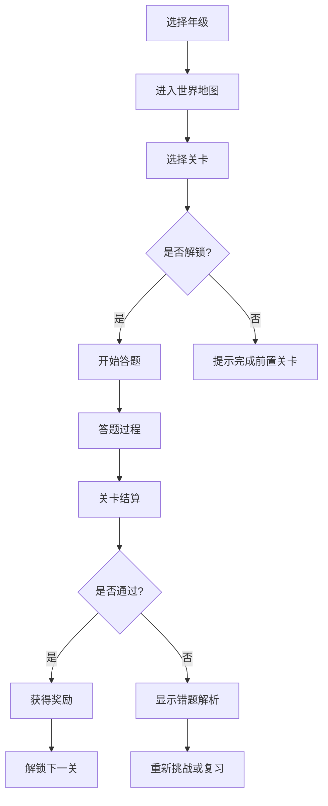
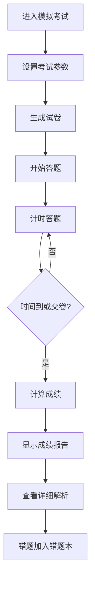

# 小学生英语学习平台 - 产品需求文档 (PRD)

## 1. 产品概述

这是一个专为小学1-6年级学生设计的英语学习平台，通过游戏化闯关模式、丰富的题库、语音播放功能和详细的教学解析，让英语学习变得有趣高效。平台涵盖单词学习、音标学习、模拟考试等核心模块，并提供外部优质学习资源导航。

**目标用户**：小学1-6年级学生及其家长、英语教师  
**核心价值**：让英语学习像玩游戏一样有趣，通过科学的记忆方法和即时反馈提升学习效果

## 2. 核心功能

### 2.1 用户角色

| 角色 | 注册方式 | 核心权限 |
|------|----------|----------|
| 学生 | 用户名/家长代注册 | 学习所有年级课程、参加考试、查看成绩 |
| 家长 | 手机号注册 | 管理孩子账号、查看学习报告、设置学习计划 |
| 游客 | 无需注册 | 体验基础功能（部分内容限制） |

### 2.2 功能模块

1. **首页**：年级选择入口、学习进度概览、每日任务、成就展示
2. **单词学习**：按年级/单元分类、图文结合、语音播放、记忆技巧
3. **音标学习**：48个国际音标教学、发音示范、口型图解、跟读练习
4. **闯关游戏**：分年级关卡、星星评分、解锁机制、排行榜
5. **模拟考试**：自动生成试卷、计时答题、详细解析、错题本
6. **题库中心**：海量题目分类、难度分级、智能推荐
7. **学习报告**：进度统计、薄弱项分析、学习建议
8. **资源导航**：优质外部学习平台链接

### 2.3 页面详情

| 页面名称 | 模块名称 | 功能描述 |
|----------|----------|----------|
| 首页 | Hero区域 | 欢迎语、今日学习任务、快速开始按钮 |
| 首页 | 年级选择 | 1-6年级卡片式选择，显示各年级进度 |
| 首页 | 成就展示 | 获得的徽章、星星总数、连续学习天数 |
| 单词学习页 | 单词列表 | 按单元分组展示，支持搜索筛选 |
| 单词学习页 | 单词卡片 | 单词、音标、释义、例句、配图 |
| 单词学习页 | 语音播放 | 美式/英式发音切换、调节语速 |
| 单词学习页 | 记忆技巧 | 联想记忆法、词根词缀分析、趣味故事 |
| 单词学习页 | 练习测试 | 选择题、拼写题、听写题 |
| 音标学习页 | 音标分类 | 元音/辅音分类展示 |
| 音标学习页 | 音标卡片 | 音标符号、发音示范、口型图解 |
| 音标学习页 | 跟读练习 | 录音对比、发音评分 |
| 闯关游戏页 | 世界地图 | 各关卡地图式展示，解锁状态 |
| 闯关游戏页 | 关卡详情 | 关卡名称、题目数量、奖励预览 |
| 闯关游戏页 | 答题界面 | 题目展示、选项、计时、提示功能 |
| 闯关游戏页 | 结算页面 | 得分、星星、奖励、下一关引导 |
| 模拟考试页 | 考试设置 | 选择年级、题型、题量、时间 |
| 模拟考试页 | 答题界面 | 题目、选项、答题卡、计时器 |
| 模拟考试页 | 成绩报告 | 分数、正确率、用时、排名 |
| 模拟考试页 | 详细解析 | 每题解析、知识点标注、相关练习推荐 |
| 题库中心页 | 分类筛选 | 按年级、题型、难度、知识点筛选 |
| 题库中心页 | 题目列表 | 题目预览、收藏、练习入口 |
| 学习报告页 | 进度统计 | 各模块学习进度、时间分布 |
| 学习报告页 | 错题本 | 错题列表、重做功能、掌握状态 |
| 学习报告页 | 薄弱分析 | 知识点掌握度雷达图、改进建议 |
| 资源导航页 | 平台分类 | 在线课程、词典工具、视频资源等分类 |
| 资源导航页 | 平台卡片 | 平台名称、简介、直达链接 |

## 3. 核心流程

### 3.1 学习流程

用户进入平台 → 选择年级 → 选择学习模块（单词/音标/闯关/考试）→ 学习/答题 → 获得反馈和奖励 → 查看解析 → 继续下一关卡或复习

### 3.2 闯关游戏流程

### 3.3 模拟考试流程

## 4. 用户界面设计

### 4.1 设计风格

- **主色调**：活泼的橙色(#FF6B35)作为主色，搭配清新的蓝色(#4ECDC4)和温暖的黄色(#FFE66D)
- **辅助色**：柔和的紫色(#A78BFA)用于音标模块，绿色(#10B981)表示正确/成功
- **按钮风格**：圆角大按钮，带有轻微阴影和hover动效，游戏化设计
- **字体**：
  - 标题：使用圆润可爱的字体（如"ZCOOL KuaiLe"或"Ma Shan Zheng"）
  - 正文：清晰易读的"Source Han Sans"或"Noto Sans SC"
  - 英文：友好的"Comic Neue"或"Quicksand"
- **布局风格**：卡片式布局，大量图标和插图，游戏化UI元素（星星、徽章、进度条）
- **图标/表情**：使用可爱的卡通图标，适当使用emoji增加趣味性
- **动画效果**：页面切换动画、答题反馈动画、奖励获得动画、进度条动画

### 4.2 页面设计概览

| 页面名称 | 模块名称 | UI元素 |
|----------|----------|--------|
| 首页 | Hero区域 | 渐变背景、卡通人物、动态欢迎语、今日任务卡片 |
| 首页 | 年级选择 | 6个彩色年级卡片，每个有独特图标和进度环 |
| 首页 | 成就展示 | 徽章墙、星星计数器、连续学习火焰动画 |
| 单词学习页 | 单词卡片 | 大卡片翻转效果、配图、播放按钮、收藏心形 |
| 单词学习页 | 记忆技巧 | 弹出式面板、图文结合、趣味插图 |
| 音标学习页 | 音标卡片 | 发音波形动画、口型示意图、跟读按钮 |
| 闯关游戏页 | 世界地图 | 2.5D地图效果、关卡节点、连接路径、解锁动画 |
| 闯关游戏页 | 答题界面 | 大字体题目、彩色选项按钮、倒计时、提示灯泡 |
| 模拟考试页 | 答题界面 | 严肃但友好的设计、答题卡侧边栏、进度条 |
| 模拟考试页 | 解析面板 | 折叠式解析、知识点标签、相关练习推荐 |
| 学习报告页 | 数据可视化 | 进度环形图、雷达图、折线图、柱状图 |
| 资源导航页 | 平台卡片 | Logo、简介、分类标签、直达按钮 |

### 4.3 响应式设计

- **桌面优先**：主要针对平板和电脑设计，适合家庭学习场景
- **移动适配**：手机端优化布局，触控友好
- **触控优化**：按钮足够大，间距合理，支持滑动操作

### 4.4 特色交互设计

- **语音播放**：点击播放按钮有波形动画，支持连续播放模式
- **答题反馈**：正确时绿色对勾+星星飞出动画，错误时红色叉+震动效果
- **关卡解锁**：解锁时有光效和庆祝动画
- **成就获得**：徽章弹出+音效+分享引导
- **进度保存**：自动保存学习进度，断点续学

## 5. 题库设计

### 5.1 题型分类

| 题型 | 描述 | 适用场景 |
|------|------|----------|
| 单词选择 | 看图选词/看词选义 | 单词学习、闯关 |
| 单词拼写 | 根据提示拼写单词 | 单词学习、考试 |
| 听音选词 | 听发音选单词 | 单词学习、闯关 |
| 音标辨析 | 选择正确音标 | 音标学习 |
| 句词填空 | 句子填空 | 综合练习、考试 |
| 情景对话 | 选择合适回答 | 综合练习 |
| 翻译题 | 英汉互译 | 考试 |
| 连线题 | 单词与释义连线 | 单词学习 |

### 5.2 题库规模规划

| 年级 | 单词量 | 题目数量 | 题型覆盖 |
|------|--------|----------|----------|
| 一年级 | 200+ | 1000+ | 全题型 |
| 二年级 | 300+ | 1500+ | 全题型 |
| 三年级 | 400+ | 2000+ | 全题型 |
| 四年级 | 500+ | 2500+ | 全题型 |
| 五年级 | 600+ | 3000+ | 全题型 |
| 六年级 | 700+ | 3500+ | 全题型 |

## 6. 外部资源导航

### 6.1 推荐平台分类

| 分类 | 平台示例 |
|------|----------|
| 在线课程 | 多邻国、VIPKID、51Talk、猿辅导 |
| 词典工具 | 有道词典、金山词霸、百度翻译 |
| 视频资源 | B站英语教学、TED-Ed、Khan Academy |
| 练习平台 | 百词斩、扇贝单词、英语流利说 |
| 绘本阅读 | Raz-Kids、牛津树、海尼曼 |
| 综合资源 | BBC Learning English、VOA Learning English |

## 7. 技术特色

- **语音合成**：使用Web Speech API实现英语发音
- **离线支持**：核心内容支持离线学习
- **数据持久化**：学习进度本地存储
- **自适应难度**：根据答题情况智能推荐题目难度
