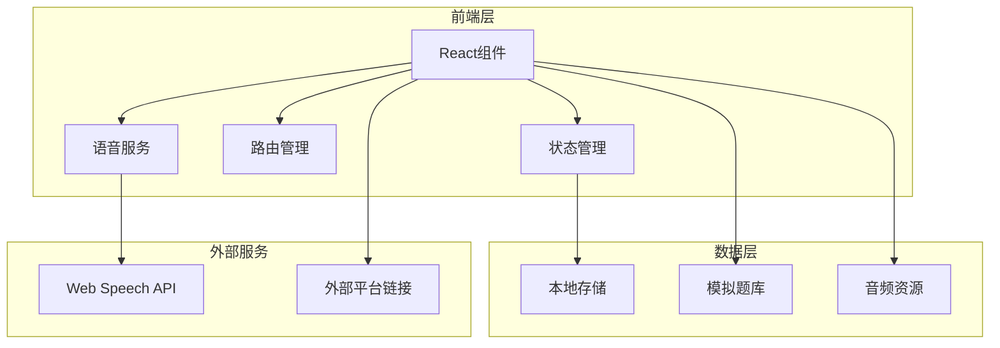

# 小学生英语学习平台 - 技术架构文档

## 1. 架构设计



## 2. 技术说明

- **前端框架**：React 18 + TypeScript
- **样式方案**：Tailwind CSS 3 + 自定义动画
- **构建工具**：Vite
- **状态管理**：React Context + useReducer（轻量级状态管理）
- **路由**：React Router v6
- **语音服务**：Web Speech API（语音合成）
- **数据存储**：LocalStorage（用户进度、设置）
- **图表库**：Recharts（学习报告可视化）
- **图标**：Lucide React + 自定义SVG
- **字体**：Google Fonts（ZCOOL KuaiLe, Noto Sans SC, Quicksand）

## 3. 路由定义

| 路由 | 页面 | 描述 |
|------|------|------|
| `/` | 首页 | 年级选择、学习概览、快速入口 |
| `/grade/:gradeId` | 年级主页 | 特定年级的学习模块入口 |
| `/grade/:gradeId/words` | 单词学习 | 单词列表和学习 |
| `/grade/:gradeId/words/:unitId` | 单元单词 | 特定单元的单词学习 |
| `/grade/:gradeId/phonics` | 音标学习 | 音标教学和练习 |
| `/grade/:gradeId/adventure` | 闯关游戏 | 游戏世界地图 |
| `/grade/:gradeId/adventure/:levelId` | 关卡详情 | 答题界面 |
| `/grade/:gradeId/exam` | 模拟考试 | 考试设置和答题 |
| `/grade/:gradeId/practice` | 题库中心 | 题目浏览和练习 |
| `/report` | 学习报告 | 进度统计和错题本 |
| `/resources` | 资源导航 | 外部平台链接 |

## 4. 数据结构定义

### 4.1 核心类型定义

```typescript
// 年级枚举
enum Grade {
  ONE = 1,
  TWO = 2,
  THREE = 3,
  FOUR = 4,
  FIVE = 5,
  SIX = 6
}

// 单词类型
interface Word {
  id: string;
  text: string;
  phonetic: string;
  meaning: string;
  example: string;
  exampleMeaning: string;
  image?: string;
  memoryTips: MemoryTip[];
  audioUrl?: string;
}

// 记忆技巧
interface MemoryTip {
  type: 'association' | 'root' | 'story' | 'image';
  content: string;
  illustration?: string;
}

// 音标类型
interface Phonics {
  symbol: string;
  type: 'vowel' | 'consonant';
  exampleWords: string[];
  description: string;
  mouthShape?: string;
}

// 题目类型
interface Question {
  id: string;
  type: QuestionType;
  grade: Grade;
  difficulty: 1 | 2 | 3;
  content: string;
  options?: string[];
  answer: string | string[];
  explanation: string;
  knowledgePoints: string[];
  relatedWords?: string[];
}

enum QuestionType {
  WORD_CHOICE = 'word_choice',
  WORD_SPELLING = 'word_spelling',
  LISTEN_CHOICE = 'listen_choice',
  PHONICS_CHOICE = 'phonics_choice',
  FILL_BLANK = 'fill_blank',
  DIALOGUE = 'dialogue',
  TRANSLATION = 'translation',
  MATCHING = 'matching'
}

// 关卡类型
interface Level {
  id: string;
  grade: Grade;
  name: string;
  description: string;
  order: number;
  questionCount: number;
  timeLimit: number;
  rewards: Reward;
  prerequisite?: string;
  theme: string;
}

// 用户进度
interface UserProgress {
  currentGrade: Grade;
  completedLevels: string[];
  stars: { [levelId: string]: number };
  wordsLearned: string[];
  wrongQuestions: WrongQuestion[];
  achievements: string[];
  studyStreak: number;
  lastStudyDate: string;
  totalStudyTime: number;
}

// 错题记录
interface WrongQuestion {
  questionId: string;
  wrongCount: number;
  lastWrongDate: string;
  mastered: boolean;
}

// 考试结果
interface ExamResult {
  id: string;
  date: string;
  grade: Grade;
  totalQuestions: number;
  correctCount: number;
  timeUsed: number;
  questions: {
    questionId: string;
    userAnswer: string;
    isCorrect: boolean;
  }[];
}
```

## 5. 组件架构

```mermaid
flowchart TB
    subgraph App["App"]
        Router[Router]
        Layout[Layout]
    end
    
    subgraph Pages["页面组件"]
        Home[HomePage]
        GradeHome[GradeHomePage]
        Words[WordsPage]
        Phonics[PhonicsPage]
        Adventure[AdventurePage]
        LevelPlay[LevelPlayPage]
        Exam[ExamPage]
        Practice[PracticePage]
        Report[ReportPage]
        Resources[ResourcesPage]
    end
    
    subgraph Components["公共组件"]
        Header[Header]
        Footer[Footer]
        GradeCard[GradeCard]
        WordCard[WordCard]
        PhonicsCard[PhonicsCard]
        QuestionCard[QuestionCard]
        ProgressBar[ProgressBar]
        Timer[Timer]
        AudioPlayer[AudioPlayer]
        Achievement[Achievement]
        Navigation[Navigation]
    end
    
    subgraph Contexts["上下文"]
        UserContext[UserContext]
        SoundContext[SoundContext]
    end
    
    Router --> Layout
    Layout --> Pages
    Pages --> Components
    Components --> Contexts
```



## 6. 数据模型

### 6.1 本地存储键值

| 键名 | 类型 | 描述 |
|------|------|------|
| `userProgress` | UserProgress | 用户学习进度 |
| `settings` | Settings | 用户设置 |
| `examHistory` | ExamResult[] | 考试历史记录 |

### 6.2 模拟数据文件结构

```
src/
├── data/
│   ├── words/
│   │   ├── grade1.ts
│   │   ├── grade2.ts
│   │   ├── grade3.ts
│   │   ├── grade4.ts
│   │   ├── grade5.ts
│   │   └── grade6.ts
│   ├── phonics.ts
│   ├── questions/
│   │   ├── grade1.ts
│   │   ├── grade2.ts
│   │   ├── grade3.ts
│   │   ├── grade4.ts
│   │   ├── grade5.ts
│   │   └── grade6.ts
│   ├── levels/
│   │   ├── grade1.ts
│   │   ├── grade2.ts
│   │   ├── grade3.ts
│   │   ├── grade4.ts
│   │   ├── grade5.ts
│   │   └── grade6.ts
│   └── resources.ts
```

## 7. 语音服务架构

```typescript
// 语音服务接口
interface SpeechService {
  // 播放单词发音
  speakWord(word: string, rate?: number): void;
  // 播放句子
  speakSentence(sentence: string, rate?: number): void;
  // 停止播放
  stop(): void;
  // 设置语速
  setRate(rate: number): void;
  // 设置音色（美式/英式）
  setVoice(type: 'US' | 'UK'): void;
}

// 使用 Web Speech API 实现
class WebSpeechService implements SpeechService {
  private synth: SpeechSynthesis;
  private voice: SpeechSynthesisVoice | null;
  private rate: number = 0.8;
  
  constructor() {
    this.synth = window.speechSynthesis;
  }
  
  speakWord(word: string, rate?: number): void {
    const utterance = new SpeechSynthesisUtterance(word);
    utterance.rate = rate ?? this.rate;
    utterance.voice = this.voice;
    this.synth.speak(utterance);
  }
  
  // ... 其他方法实现
}
```

## 8. 性能优化策略

- **代码分割**：按路由懒加载页面组件
- **图片优化**：使用WebP格式，懒加载图片
- **题库分片**：按年级分文件，按需加载
- **缓存策略**：学习进度实时保存到LocalStorage
- **动画优化**：使用CSS动画优先，JS动画使用requestAnimationFrame

## 9. 项目目录结构

```
english-learning-platform/
├── public/
│   ├── images/
│   │   ├── words/          # 单词配图
│   │   ├── phonics/        # 音标口型图
│   │   ├── achievements/   # 成就徽章
│   │   └── backgrounds/    # 背景图
│   └── favicon.ico
├── src/
│   ├── components/         # 公共组件
│   │   ├── common/         # 通用组件
│   │   ├── game/           # 游戏相关组件
│   │   ├── learning/       # 学习相关组件
│   │   └── ui/             # UI基础组件
│   ├── contexts/           # React Context
│   ├── data/               # 模拟数据
│   ├── hooks/              # 自定义Hooks
│   ├── pages/              # 页面组件
│   ├── services/           # 服务层
│   ├── styles/             # 全局样式
│   ├── types/              # TypeScript类型
│   ├── utils/              # 工具函数
│   ├── App.tsx
│   └── main.tsx
├── index.html
├── tailwind.config.js
├── tsconfig.json
├── vite.config.ts
└── package.json
```

## 10. 开发阶段规划

### 第一阶段：基础框架
- 项目初始化和配置
- 路由搭建
- 布局组件开发
- 基础UI组件库

### 第二阶段：核心学习功能
- 单词学习模块
- 音标学习模块
- 语音播放服务
- 题库数据准备

### 第三阶段：游戏化功能
- 闯关游戏模块
- 关卡系统
- 成就系统
- 排行榜

### 第四阶段：考试系统
- 模拟考试模块
- 自动出题算法
- 详细解析展示
- 错题本

### 第五阶段：数据与报告
- 学习报告模块
- 数据可视化
- 进度统计
- 资源导航页

### 第六阶段：优化完善
- 动画效果优化
- 响应式适配
- 性能优化
- 用户体验打磨
